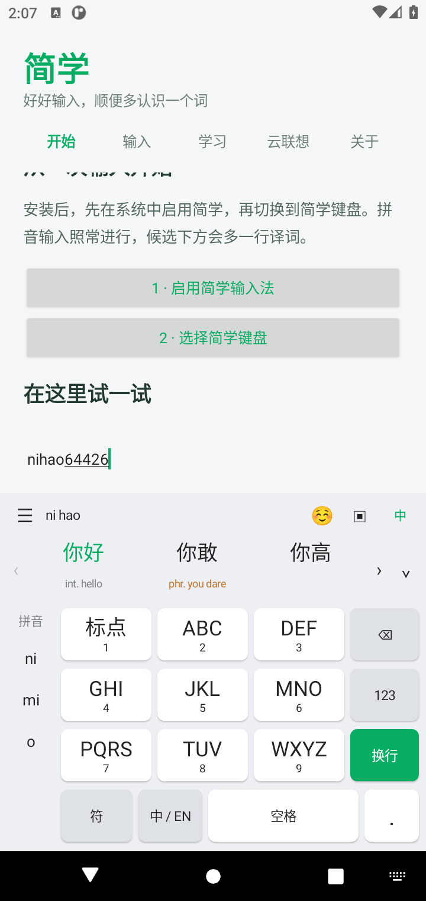
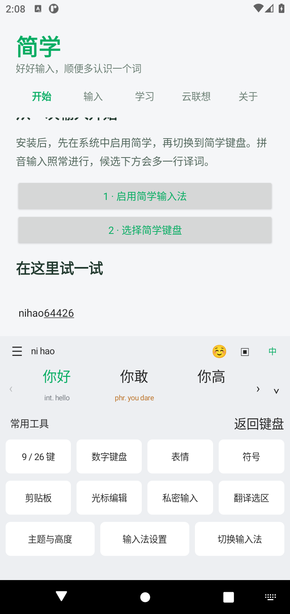
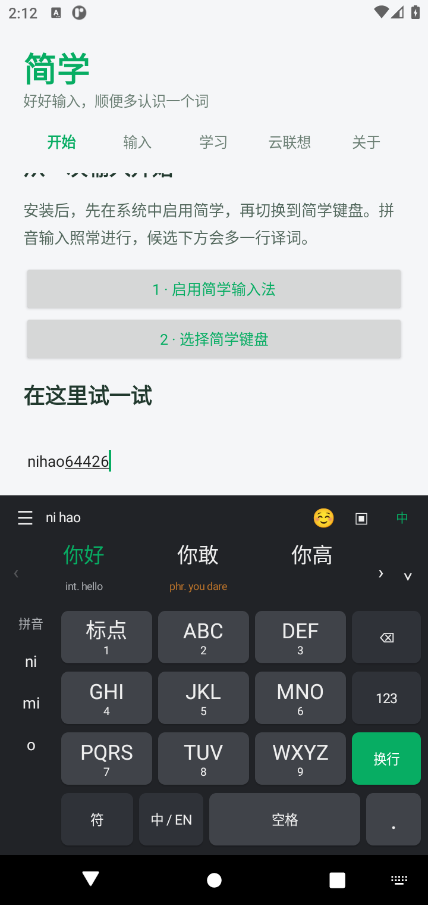

# 简学输入法 · Android

基于 [青简 / Qingjian](https://github.com/qingjian-team/qingjian) 的开源 Android 输入法，复用原项目的 Rust 引擎、正式词库、译词与本地整句模型，为安卓实现日常中文输入与候选译词学习。

这是独立移植，使用自己的名称与图标，不代表青简官方。当前为 **0.2.0-dev 开发预览版**，支持 **Android 8.0+，ARM64 与 x86_64**。代码采用 **GPL-3.0-or-later**；数据保留各自许可，详见 [NOTICE](NOTICE.md)。

## 安装与使用

[下载 0.2.0-dev 开发预览版](https://github.com/zstar239/jianxue-android/releases/tag/v0.2.0-dev) · [直接下载 APK](https://github.com/zstar239/jianxue-android/releases/download/v0.2.0-dev/jianxue-debug.apk) · [使用说明](docs/USER.md)

Release 提供 APK、包含第三方依赖的对应源码包、SHA-256 校验值和验证记录。当前 APK 使用调试签名，适合体验和反馈；安装后首次启动会加载词库与模型。

<p>
  
  
  
</p>

本地交付文件在 `dist/`：

- `jianxue-debug.apk`：可安装的开发 APK，使用调试签名。
- `jianxue-android-0.2.0-source.zip`：对应源码、固定版本上游、Rust 第三方源码、许可与构建脚本。
- `SHA256SUMS`：APK 和源码包校验值。
- `artifact-verification.json`：正式资源、JNI 和 16 KB 对齐检查结果。

安装 APK 后，打开「简学」，点击「启用简学输入法」，在系统中开启，再点击「选择简学键盘」。首次使用会校验并加载本地词库和模型，需要稍等。

默认中文使用九键，按 `64426` 输入「你好」；也可在工具面板选择 9 / 26 键，使用二十六键输入 `nihao`、`kaifa` 或 `woxiangxuexi`。左侧选择拼音消歧，⌄ 展开候选；空格选择首个候选，‹ / › 翻页，点击候选输入汉字；长按候选可输入译词或清除此词的个人学习。空格左右滑动移动光标，中文 / EN 键切换输入模式，右上角切换私密输入，地球键切换系统输入法。

## 功能覆盖

| 功能 | Android 实现 |
| --- | --- |
| 九键拼音 | 数字到拼音的词库索引、有界路径搜索、首音节消歧、连续输入与点选余码；仅中文全拼 |
| 移动端工具 | 候选展开、剪贴板、表情分类与最近使用、常用符号、光标与选区编辑 |
| 外观 | 简洁浅灰键盘、白色圆角按键、绿色操作键；跟随系统 / 浅色 / 深色、按键高度、可选触感 |
| 全拼、简拼、拼写纠错、整句输入 | 原 Qingjian Engine 与正式字词库 |
| 本地整句重排 | 随 APK 提供含章·通变 small，停顿后异步处理，可关闭 |
| 双拼 | 小鹤、自然码、微软、搜狗、智能 ABC、小浪、首道 |
| 五笔与注音 | 五笔 86、五笔拼音混输、大千注音 |
| 模糊音、繁体、中文标点 | 设置中选择；标点转换由原引擎处理 |
| 英文补全、中英混输、emoji | 使用原引擎和随包词表 |
| 候选译词 | 英语、日语、西班牙语，一次只显示一种，可关闭；支持译词上屏与读音 |
| 生词与学习 | 生词颜色标记、个人词频、输入统计、生词本、TSV 导出、重置 |
| 领域词库 | 11 个领域可选；导入 TSV、Rime .dict.yaml 和 QJ 词库，最大 20 MB |
| 常用短语 | 新增、编辑、删除、启停；固定候选位置 1–9，保留空格与换行 |
| 笔画辅助码 | 默认关闭；完整拼音后敲分号，再输入 h / s / p / n / z |
| 算式与码点 | 如 `v1+2`、`u4e00`；双拼及五笔使用大写 V / U 进入 |
| 云联想、整句补全、问字、释义兜底 | 默认关闭；自行配置兼容的 HTTPS 接口、模型和密钥 |
| 翻译选中文字 | 点击键盘「译」，结果出现后点击替换原选区；选区改变则取消 |
| 安卓输入适配 | 密码直输、数字布局、编辑器操作、连续退格、暗色键盘、横屏、无障碍标签 |

设置的「输入」页选择方案与词库，「学习」页选择语言和查看统计，「云联想」页保存接口后选择是否启用。

## 隐私

默认离线，不启用输入日志。剪贴板仅在打开面板时读取纯文本，最近记录只在内存中保留；手动收藏最多 20 条，使用 Android Keystore 加密保存。私密 / 密码输入不显示或记录历史；系统标为敏感的剪贴板不进入历史。词频、统计与词汇记录保存在应用私有目录；密码、系统要求禁止个性化学习的输入和手动私密输入不写学习或统计。密码文字直接进入系统输入连接，不交给词库引擎。

用户启用云联想后，当前拼音和光标前后最多 64 / 32 字会发送给用户指定的服务商。选区翻译会发送所选文字，最多 2000 字。私密输入不发送；网络失败保留本地输入。API Key 由 Android Keystore 加密保存，应用没有账号或代理服务，禁止系统备份及设备转移。

## 开发

详见 [构建说明](docs/BUILD.md)、[使用说明](docs/USER.md)、[结构说明](docs/ARCHITECTURE.md)、[验证记录](docs/VALIDATION.md)。

```bash
bash scripts/fetch-upstream.sh
bash scripts/dev.sh setup
bash scripts/dev.sh data
bash scripts/dev.sh vendor-dependencies
bash scripts/dev.sh check
bash scripts/dev.sh apk
bash scripts/dev.sh jvm
```

固定上游版本：`c08ae57cb88b6a4a46f4a5e9c1d6d11c5e69222e`。正式数据由上游 `data-v3` 和 `data.lock` 固定并校验。应用没有把样例词库当作正式输入词库。

## 当前限制

尚未提供 ARMv7 / 32 位版本和 Windows 原生构建脚本。词库导入与上游一样不展开 Rime import_tables 或自定义列顺序；移动端没有桌面快捷键录制和系统文本替换。移动端尚未实现语音、手写和滑行输入，没有桌面主题编辑器或自动更新器。九键先用词库与拼音路径解析，沿用上游本地词图整句转换；停顿后的神经重排与云联想目前用于二十六键，九键输入准确率仍需要更多语料与实机验证。

云服务接入代码已实现，真实服务的质量、延迟与协议差异仍需用自己的密钥测试。开发 APK 和模拟器验证不能覆盖各手机厂商、所有第三方编辑器或 Android 16 KB 实机。发布前需要更多真机测试和维护者管理的正式签名。

分发 APK 时应同时提供对应源码和构建说明，保留上游与数据的版权、许可和署名。

欢迎通过 [Issues](https://github.com/zstar239/jianxue-android/issues) 反馈问题或提出建议；提交改动前请阅读 [贡献说明](CONTRIBUTING.md)。版本变化见 [CHANGELOG](CHANGELOG.md)。
